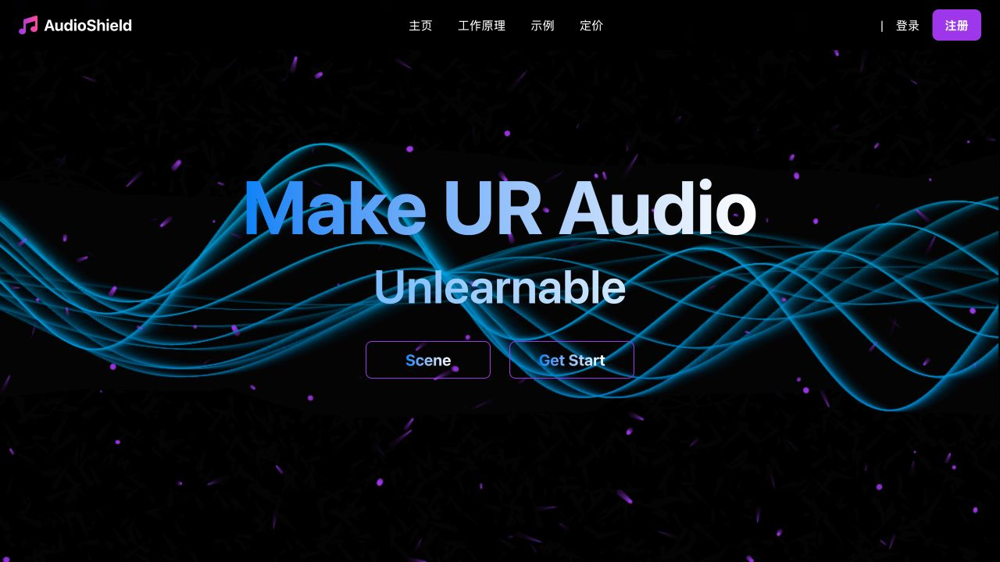
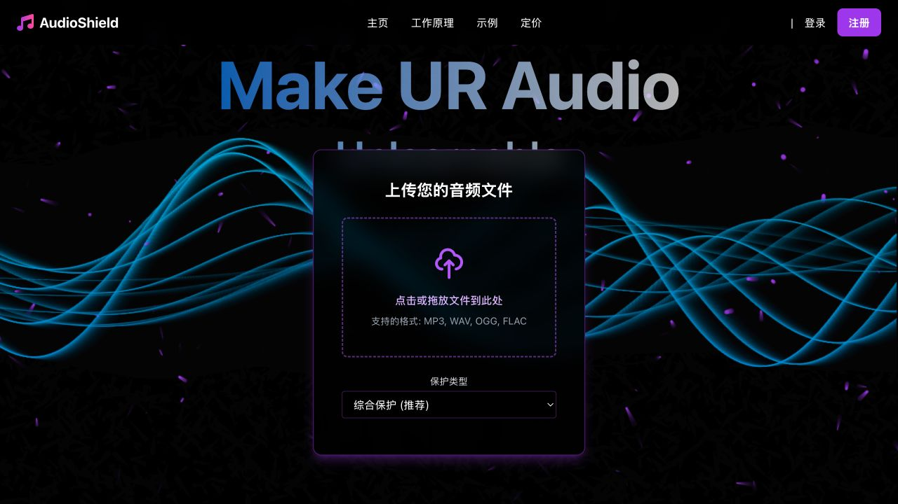

# AudioShield 前端

该目录是项目的 React 前端，用于展示音频不可学习保护流程。界面提供首页、Scene 模式入口、音频上传入口和处理结果下载入口；实际音频保护逻辑由后端 `/api` 接口完成。

## 界面展示





## 主要功能

- 上传 MP3、WAV、OGG、FLAC 等音频文件。
- 选择综合保护、声波保护或误差最小化保护。
- 调用同源 `/api/process-audio` 接口处理音频。
- 接收后端返回的受保护音频，并提供在线试听和下载。
- Scene 模式通过 `/api/scene/*` 接口控制实时保护状态。

## 本地运行

```bash
cd web
npm install
npm start
```

默认访问地址：

```text
http://localhost:3000
```

本地开发时需要另行启动后端接口，或通过代理/同源部署方式提供 `/api` 路由。

## 生产构建

```bash
cd web
npm run build
```

构建产物位于 `web/build`。项目部署入口 `deploy/run_frontend_api_5001.py` 会同时提供前端静态页面和后端 API，适合课程演示时一体化启动。
